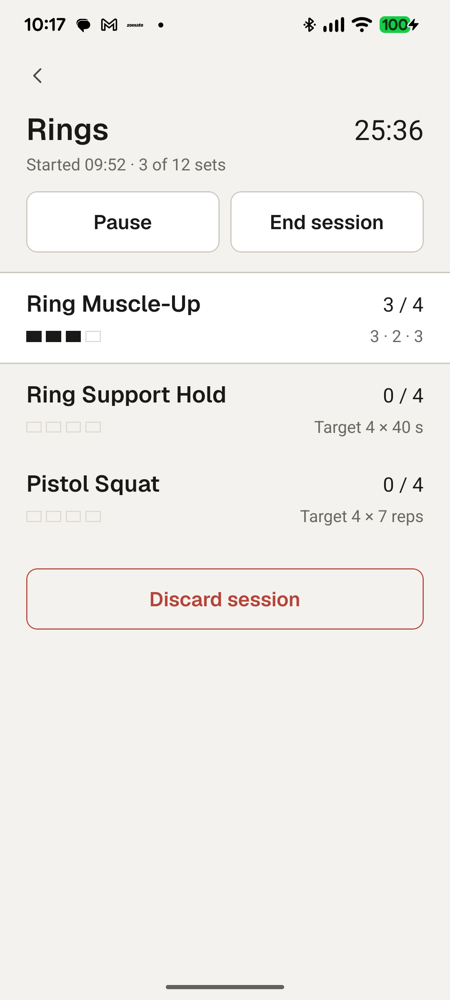
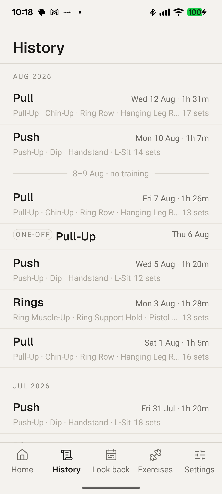
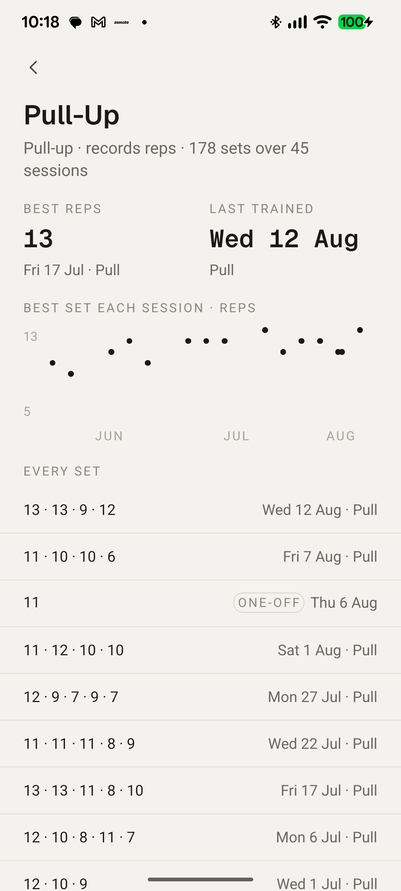
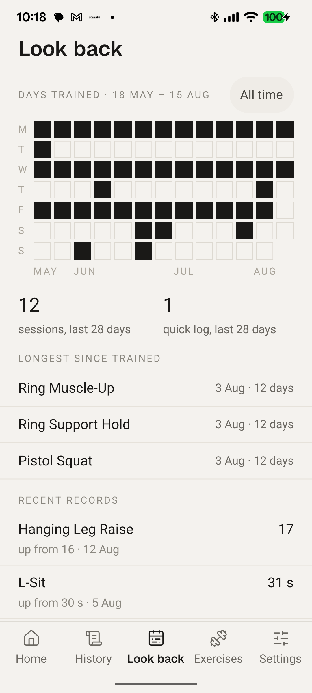
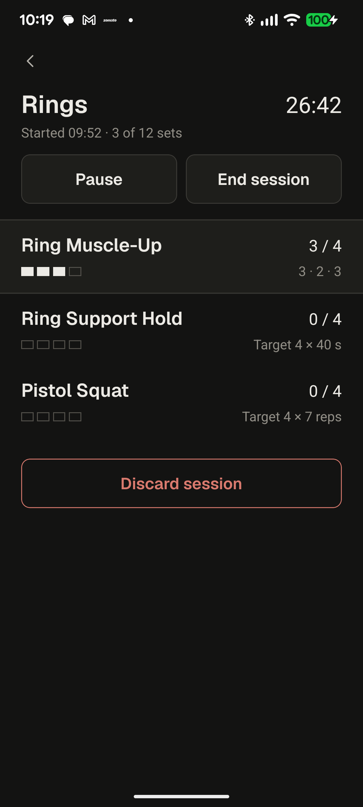
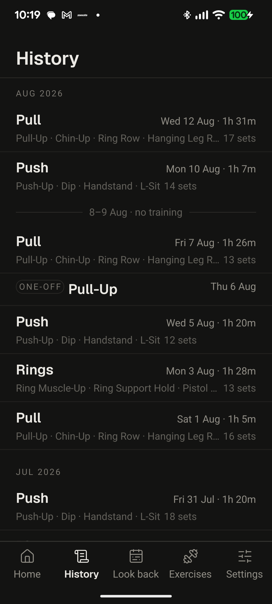
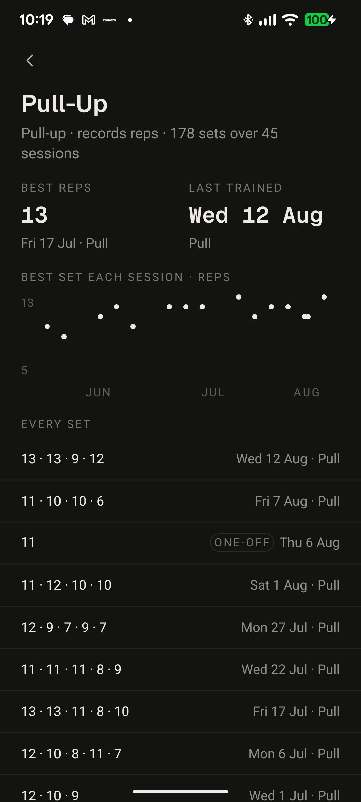
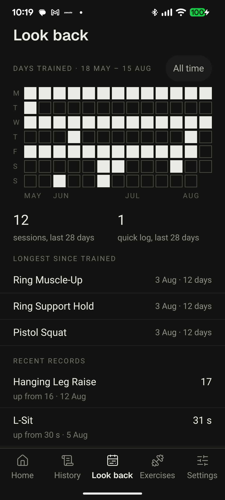

# Zoomies

A training journal for calisthenics and gymnastic rings. One person, one phone,
no account, no server, no network. It records what you did, so that later you
can see what you did.

It is a **journal, not a coach**. It does not prescribe workouts, correct form,
suggest progressions, or have an opinion about whether you trained enough.

<p align="center">
  
  
  
  
</p>

---

## Why it exists

Because of one specific, repeated, ordinary failure:

> **Sets get forgotten or missed during training, because you are tired.**

Halfway through a session, four exercises deep, forearms burning, you cannot
reliably remember whether that was your second or third set of chin-ups. You
either do an extra one, or skip one, or stand there trying to reconstruct the
last four minutes.

Paper works but does not add up. Spreadsheets are miserable with chalky hands.
Three other fitness apps were abandoned before this one, for being loud, slow,
or dishonest — and all of them wanted an account and a network connection that
a garage at night does not have.

So every feature here serves one of exactly two purposes:

1. **Fast logging during training**, when you are tired, breathing hard, and
   want the phone out of your hands.
2. **Reflection after training**, when you are sitting down and want to know
   whether anything is actually moving.

A feature serving neither does not belong, however good it is.

---

## What it does

**Plan.** Templates of exercises with per-slot targets — three sets of eight, or
a thirty-second hold. Editing a template never rewrites history: targets are
snapshotted onto the session when it starts.

**Train.** Start a session from a template. Each exercise shows a live `2 / 4`
counter and what you did last time. Log a set in one tap; the button names the
set it is about to write, so *was that my second or third* is answered at the
moment of pressing. Holds are timed by a tap-to-start clock that fills a
hairline track and beeps at the target.

**Record.** A history timeline, each session readable back set by set. Per
exercise: every set ever logged, personal records per metric, and a dot plot of
the best set over time.

**Look back.** Days trained as a grid of filled and unfilled squares — a
quarter to a screen, scrolling back as far as the history goes — plus what has
not been trained lately, and recent records.

**Keep.** Export everything to a JSON file. It is a copy of the database, not a
view of the application — soft-deleted rows included — so it is a real backup
rather than a report.

Forty-two built-in exercises across twelve families, fifteen active by default;
the rest surface as suggestions when you train something in the same family.
Custom exercises and custom metric configurations are supported.

---

## What it refuses to do

This list is the design, as much as the feature list is.

- **No accounts, no sync, no network.** There is no server and there are no
  network calls. It works in a basement and on a plane.
- **No streaks.** The week row is seven dots with no number attached. No flame,
  no count, no reset penalty.
- **No celebration.** Records are stated, not congratulated. No confetti, no
  counting-up numbers, no animated reveals.
- **No accent colour.** Emphasis is weight, rule and solid ink. `danger` is the
  only hue in the system and it reaches delete and discard alone.
- **No shadows, gradients, blur or elevation.** Depth is one surface against
  another.
- **No illustration.** No empty-state graphics, no doodles.
- **No gamification, analytics, ads, subscriptions, or social anything.**

And two rules that matter more than they look:

- **Null means not recorded. Zero means zero.** A value you did not enter is
  never stored as `0`, and is displayed as `—`.
- **Nothing is prescribed.** The only way a target ever increases is a prompt
  offering it after you beat it — on a majority of sets, not one lucky one.

Both themes follow the system by default, and every token has a dark value — so
no component in the codebase contains a theme conditional.

<p align="center">
  
  
  
  
</p>

---

## How it is built

**A set stores no measurements.** A `sets` row records that an effort happened:
its index, whether it went to failure, when. The values live in
`set_metric_values`, one row per metric.

```
12 reps, felt strong   =   one sets row + two set_metric_values rows
```

This is the central decision in the schema and it looks like over-engineering
until you change an exercise's metrics. Because the values hang off metric ids
rather than columns, renaming a metric, reordering them, adding one or deleting
one leaves every historical row byte-identical. Collapsing this into columns on
`sets` would make every metric change a migration over training history.

**Aggregates are never stored.** `24 reps` does not exist in the database. It is
a `SUM` over individual sets, computed at read time. There is no total that can
drift away from the rows it came from.

**Timers derive from timestamps**, never from accumulated `setInterval` ticks.
Backgrounding the app for ninety seconds does not lose ninety seconds.

**Writes commit before the UI moves.** Every mutation is a single transaction
that resolves after `COMMIT`. A force-quit mid-session loses nothing — which is
the first invariant, and the reason the application exists.

**Both charts are `View`s.** The days-trained grid and the best-set trend draw
no axes, gridlines, tooltips or animations, because the design system forbids
all four — which is every feature a charting library sells. So there is no
charting dependency.

---

## Stack

| Layer | Choice |
|---|---|
| Platform | Expo SDK 57 (React Native 0.86, React 19.2), managed workflow |
| Language | TypeScript, `strict` with `noUncheckedIndexedAccess` |
| Database | SQLite on device via `expo-sqlite` — the source of truth |
| ORM | Drizzle ORM, `drizzle-kit` migrations (9 tables, 7 migrations) |
| Routing | Expo Router, typed routes |
| Styling | NativeWind v4. Every colour, space and size is a token |
| Components | `react-native-reusables`, copied into the repo and owned |
| Icons | `lucide-react-native` |
| Fonts | Geist and Geist Mono, bundled. All numerals are mono |
| State | Zustand, ephemeral only — anything durable goes to SQLite |
| IDs | UUID v7, so rows sort chronologically by primary key |
| Charts | None |

No backend, no state-management library beyond Zustand, no charting library, no
component library beyond the one that was copied in and edited.

---

## Running it

```bash
npm install
npm start                 # Expo dev server
npm run android           # build and run on a device or emulator
```

Native Android project, if it is missing:

```bash
npx expo prebuild --platform android --no-install
printf 'sdk.dir=%s/Android/Sdk\n' "$HOME" > android/local.properties
```

Both lines — `prebuild` writes everything except `local.properties`, which is
machine-specific and the one file it will not recreate.

```bash
npm run typecheck
npm run lint
npm test
npm run deploy            # debug APK, installed on the attached device
npm run release -- minor  # signed APK, tagged, published to Releases
```

**Installing it:** download the APK from
[Releases](https://gitea.15092021.xyz/pratik/zoomies/releases) onto the phone.
There is no store listing.

---

## Tests

285 unit tests over the parts where being wrong would be silent: timer
arithmetic, the personal-record fold and its ties, the target-raise majority
rule, week and day boundaries, duration and value formatting, export
completeness, and the parsing edge where *null* is kept distinct from *zero*.

Export completeness is tested against the real `db/schema.ts` — tables are
discovered from the schema and columns from `SELECT *`, so adding a table cannot
quietly produce incomplete backups.

**What is not tested:** there are no component, navigation, snapshot or E2E
tests. Interface behaviour is verified by a written smoke test walked on a
physical device, phase by phase, and the gaps in that are recorded rather than
glossed over.

---

## How this was built

**This is a code-assisted project, written with [Claude
Code](https://claude.com/claude-code).** Saying so plainly, because the
interesting part is not that a model wrote code — it is what had to exist around
it for the result to hold together.

Four specification documents were written before the first line of code: the
feature set and data model, the technology choices, the visual design system
down to the spacing scale, and a phased build plan. Each was authoritative in
its own domain, and a request that conflicted with one had to change the
document first. `CLAUDE.md` in this repository is the working agreement that
sits on top of them — the invariants, the conventions, and an explicit list of
things not to build.

Eleven phases, each finished and verified on a physical Pixel before the next
began. Several decisions in here are recorded reversals: a rest timer specified
and then cut before it was built, a charting library twice planned and twice
found unnecessary, a metric editor rebuilt rather than patched a fourth time.

The specifications, the build plan, the development log and the engineering
notes are kept privately. This README and `CLAUDE.md` are the public part.

---

## Status

Version 1, in daily personal use. Android only for now; nothing in the code is
iOS-specific, but nothing has been verified there either. Not on any store, and
not intended for one — bug reports and ideas go to
[Issues](https://gitea.15092021.xyz/pratik/zoomies/issues).
